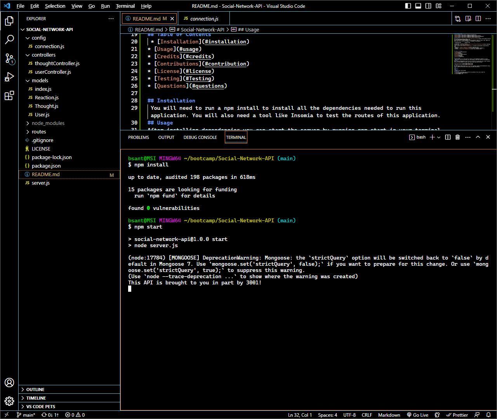
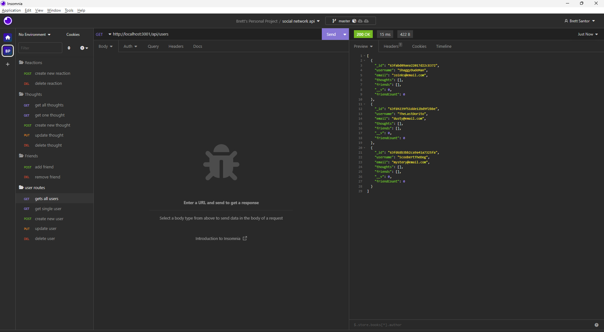
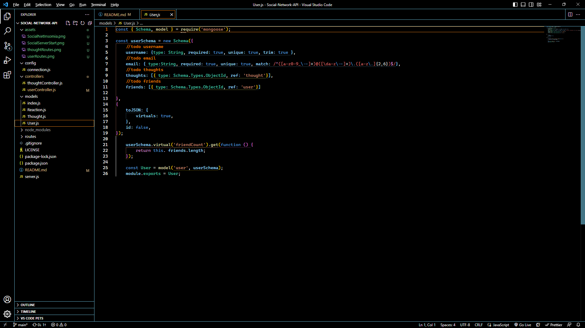
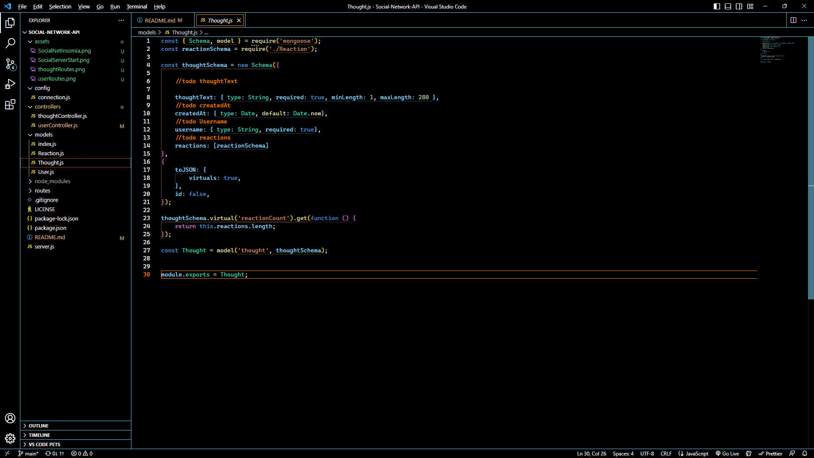
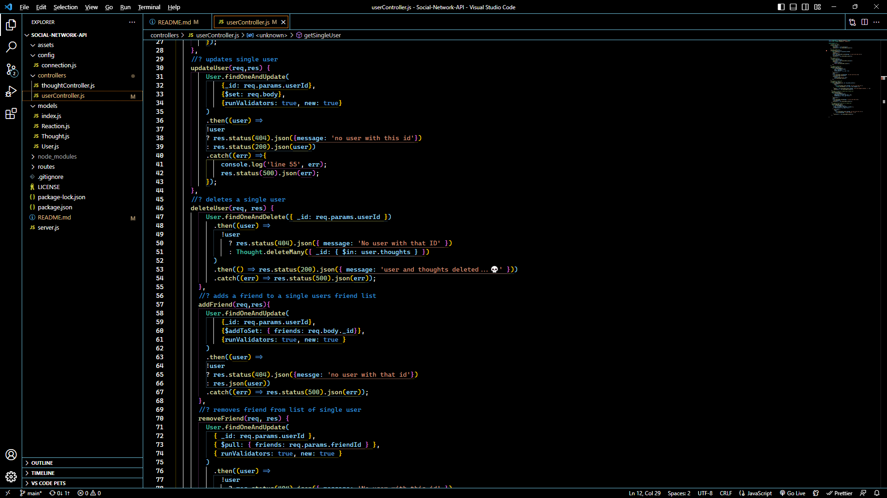
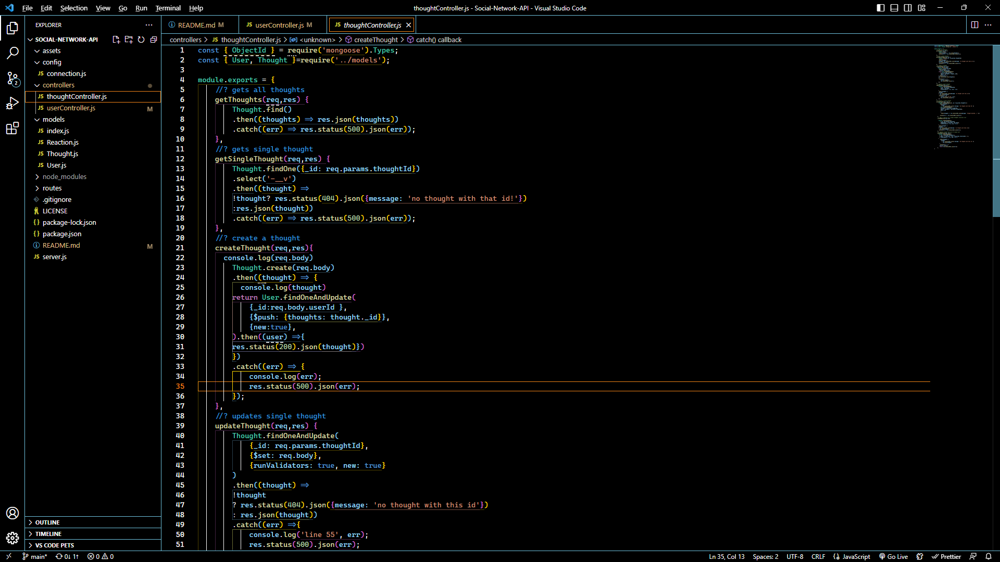

# Social-Network-API

## description
[Click this link to watch a video of this application working.](https://drive.google.com/file/d/1lVaXVo3MD4nMJMRpGHTu8NQMt7hmRUHg/view)
This is an API for a Social Network, it utilizes RESTful routes to create, read, update and delete data such as users and thoughts to a database using Mongoose. 

| Technology Used         | Resource URL           | 
| ------------- |:-------------:| 
| Javascript    | [https://developer.mozilla.org/en-US/docs/Web/JavaScript](https://developer.mozilla.org/en-US/docs/Web/JavaScript) | 
| Git | [https://www.w3schools.com/git/default.asp](https://www.w3schools.com/git/default.asp)     |
| express.js | [https://expressjs.com/](https://expressjs.com/)     |
| Mongoose    | [https://mongoosejs.com/docs/](https://mongoosejs.com/docs/) |   
| Insomnia | [https://docs.insomnia.rest/](https://docs.insomnia.rest/)     |

## Table of Contents 
 * [Installation](#installation)
* [Usage](#usage)
* [Credits](#credits)
* [Contributions](#contribution)
* [License](#license)
* [Testing](#Testing)
* [Questions](#questions)

## Installation 
 You will need to run a npm install to install all the dependencies needed to run this application. You will also need a tool like Insomia to test the routes of this application.
## Usage 
After installing dependencies you can start the server by running npm start in your terminal. This will allow Insomia to connect your local server and test the routes.

 
 ## Learning Points
 Building this API allowed me to interact with MongoDB using the Mongoose Object Data Modeling library. Utilizing models in a same but different way as a mysql database was a good transitioning point to a nosql database.
 
 
The routes were also the same but different and made this transition easier

## Credits 
All this coding made possible by [Jerome Chenette](https://github.com/jeromechenette) and my fellow students who help each other along the way
## Contributions 
 n/a
## License 
 MIT
## Testing 
 Insomia
## Questions 
 If you have any questions you can refer to my github at this link or email me! 
 * [Github](github.com/BrettSantor) 
* b.santor27@gmail.com